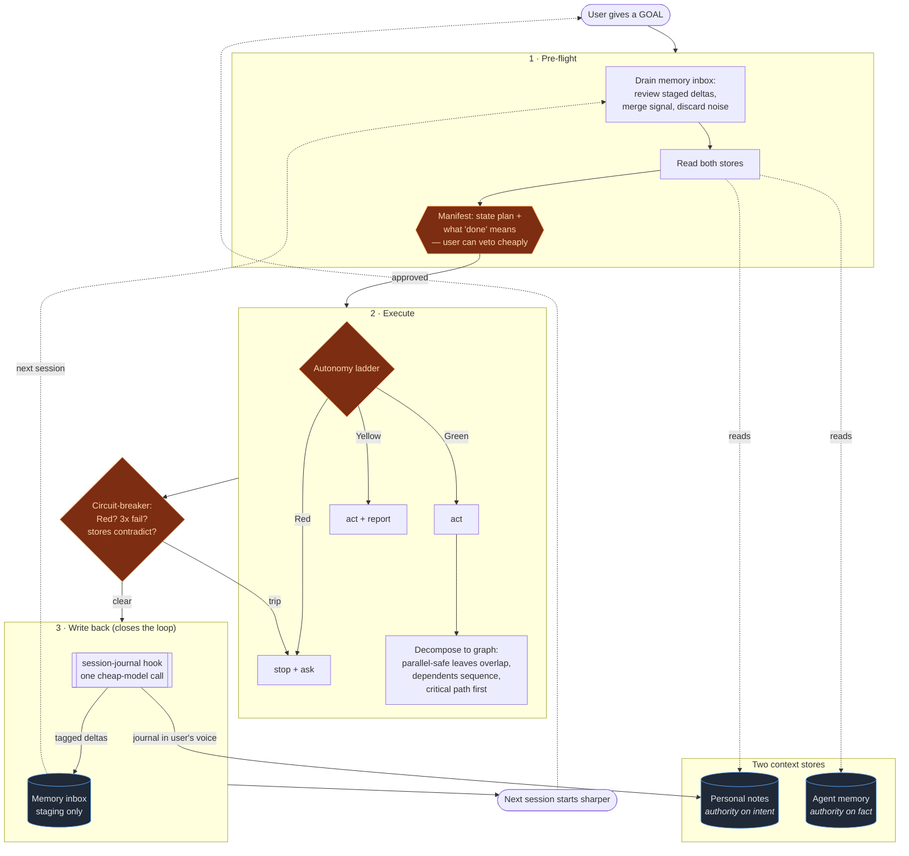

# jfound-agentic-framework

**Stop re-explaining yourself to your AI every session.**

Most people use an AI agent like a vending machine: feed it context, get a
result, walk away. Next time, you start from zero — same explanations, same
preferences, same "actually, I prefer it this way." Everything the agent
figured out about you and your work evaporates the moment the window closes.

This is a small, opinionated framework that fixes that. You give your agent a
**goal**. It drives the goal to a finish line *you can check* — using a model
of how *you* decide and a record of what already happened — and every session
leaves it a little sharper than it found it. It compounds.

It's not a library you import. It's a set of operating rules you drop into your
agent's instructions, plus one hook that closes the loop. Works with Claude
Code out of the box; the ideas port to any agent that has a system prompt and
an end-of-session hook.

---

## The shape of it

## The three rules

**1. The autonomy ladder — how much it does without asking.**
Green: just do it. Yellow: do it, then tell you. Red: stop and ask. Defined
once, so the agent isn't a bottleneck on your own tooling, and you're not
rubber-stamping things that were always safe.

**2. Parallel-agent orchestration — when it splits work up.**
One conductor. Fan out only for work that's independent *and* read-heavy *and*
worth it (more agents ≈ an order of magnitude more tokens, not free speed).
Dependent steps run in order. This keeps "spin up more agents" from becoming a
reflex that burns money and produces incoherent results.

**3. The self-driven goals loop — how it runs a goal.**
Read both stores → state the plan and what "done" looks like (you can veto in
five lines) → execute within the ladder → write back what changed → next
session starts ahead of where this one began.

## Why two memory stores

- **Your personal notes** are the authority on what you *want* — intent,
  priority, preference, in your voice.
- **The agent memory** is the authority on what *is* — technical state, what
  was already tried.

They stay separate on purpose. When they disagree: your notes win on intent,
the agent memory wins on technical fact. The agent's model of *you* lives here
too, and it gets shown back to you in the pre-flight — so a wrong read of you
gets corrected before it's acted on, not after.

## Why a review gate (the part that keeps it from rotting)

At session end a cheap, fast model skims the transcript and extracts candidate
facts. Those do **not** go straight into trusted memory — they land in an
inbox. The capable model reviews and merges them at the next pre-flight.
**Cheap model proposes; capable model disposes.** That review is the entire
reason this stays signal instead of turning into a swamp of auto-generated
noise.

---

## Quick start

1. **Drop the doctrine in.** Append [`framework/AGENTS.md`](framework/AGENTS.md)
   into your agent's always-loaded instructions (for Claude Code, your
   `CLAUDE.md`). Tune the bracketed placeholders to your setup.
2. **Set up memory.** Copy [`memory/`](memory/) somewhere your agent reads.
   `MEMORY.md` is the index it loads every session; `_INBOX.md` is the staging
   area; `templates/` shows the file shapes.
3. **Install the loop.** Wire the
   [`session-journal`](hooks/session-journal/) hook into your agent's
   `SessionEnd`. Setup is in its README. (Requires `jq`.)
4. **Use it.** Stop giving step-by-step instructions. Give goals. Correct it
   when its pre-flight reads you wrong — that's how it learns you.

Full reasoning behind every choice is in
[`docs/architecture.md`](docs/architecture.md).

## Honest status

This is a working foundation, deliberately imperfect, designed to sharpen the
more it's used. It is not a turnkey product — it's a set of rules and one
script that make an agent accumulate judgment instead of resetting to zero.
Fork it, bend the ladder tiers to your risk tolerance, swap the cheap model,
make it yours.

## License

MIT — see [LICENSE](LICENSE).
